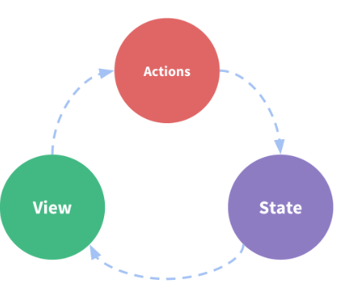

###  Redux란.. ?
#### "action"이라는 이벤트를 사용하여 store에 객체 형태로 값을 저장하여 애플리케이션 상태를 관리하고 업데이트하기 위한 패턴과 라이브러리이다.

 

### 우리가 Redux를 사용해야 하는 EU
#### Redux가 제공하는 패턴과 도구를 사용하면 애플리케이션의 상태가 언제, 어디서, 왜, 어떻게 업데이트 되는지, 

#### 그리고 해당 변경이 발생할 때 애플리케이션 로직이 어떻게 동작하는지 더 쉽게 파악할 수 있다.

#### 이것을 통해, "전역" 상태를 관리하는데 좋다

 

### 언제 Redux를 사용해야 하는가
 

- 앱의 여러 곳에 필요한 대량의 애플리케이션 상태가 존재
- 앱 상태는 시간이 지남에 따라 자주 업데이트 됨
- 해당 상태를 업데이트하는 논리는 복잡할 수 있음
- 이 앱은 중간 또는 대규모 코드 베이스를 가지고 있으며 많은 사람이 작업할 수 있을 때
 

 

### Redux를 사용하는데 알아야 할 몇 가지 용어와 개념
 

```javascript
function Counter() {
  // State: a counter value
  const [counter, setCounter] = useState(0) // counter 상태

  // Action: code that causes an update to the state when something happens
  const increment = () => {
    setCounter(prevCounter => prevCounter + 1) // => 연산자로, 실제 state 값 변화가 일어남
  }

  // View: the UI definition
  return (
    <div>
      Value: {counter} <button onClick={increment}>Increment</button>
    </div>
  )
}
 ```

### 이는 다음과 같은 부분으로 구성된 독립형 앱이다.

- 앱을 구동하는 진실의 원천인 상태(state)
- 현재 상태를 기반으로 하는 UI의 선언적 설명인 뷰(<div>등 요소..)
- 사용자 입력에 따라 앱에서 발생하는 직업, 이벤트 및 상태의 트리거 업데이트(prevCounter => prevCounter +1)
### 이는 "단방향 데이터 흐름"의 작은 예이다.

- State : 특정 시점의 앱 상태를 설명
- UI는 해당 상태를 기반으로 렌더링
- 무언가 발생하면 (예 : 사용자가 버튼을 클릭하는 경우) 발생한 사항에 따라 상태가 업데이트
- UI는 새 상태를 기반으로 다시 렌더링

 

#### 그러나 여러 구성 요소가 동일한 상태를 공유하고 사용해야 하는 경우에는 "단순성"이 깨질 수 있다.

#### 이것을 해결하는 방법은 "구성 요소에서 공유 상태를 추출하여 구성 요소 트리 외부의 중앙 위치에 두는것"이다.

 

#### 이를 통해 구성요소 트리는 큰 "뷰"가 되고 모든 구성 요소는 트리의 어디에 있는 상태에 엑세스하거나 작업을 트리거 할 수 있다.

#### 이것이 Redux의 기본 아이디어이다.

 

 

### "불변성"을 지켜야 한다.
 

```javascript
const obj = { a: 1, b: 2 }
// still the same object outside, but the contents have changed
obj.b = 3

const arr = ['a', 'b']
// In the same way, we can change the contents of this array
arr.push('c')
arr[1] = 'd'
 ```

#### 아래 코드와 같이 객체에 직접 접근이나, push로 원본 배열의 값을 수정하면 안된다.

#### 이는, map과 filter를 사용하는 이유와 같은 이유이다.(지난 포스트에서 배웠죠?)

 

 

### Reducer의 짧은 예시
```javascript
const initialState = { value: 0 }

function counterReducer(state = initialState, action) {
  // Check to see if the reducer cares about this action
  if (action.type === 'counter/increment') {
    // If so, make a copy of `state`
    return {
      ...state,
      // and update the copy with the new value
      value: state.value + 1
    }
  }
  // otherwise return the existing state unchanged
  return state
}
 ```

#### 위 코드는 Reducer의 특정 규칙을 나타낸다.

 

- state 및 action 인수를 기반으로 새로운 상태 값만 계산해야한다.
- 기존의 객체 또는 배열을 수정할 수 없다. 대신 기존을 복사하고 복사된 값을 변경하여 변경 불가능한 업데이트를 해야한다
- 비동기 논리를 수행하거나 무작위 값을 계산하거나 기타 "부작용"을 발생시키면 안된다.
 

 

### Redux 함수 맛보기
#### 현재 아래 코드는 저장소는 리듀서를 전달하여 생성하고 있다.

```javascript
import { configureStore } from '@reduxjs/toolkit'

const store = configureStore({ reducer: counterReducer })

console.log(store.getState()) // 현재 상태 값을 반환
// {value: 0}
 ```

#### store에는 dispatch라는 메소드가 있는데, 상태를 업데이트하는 유일한 방법은 `store.dispatch()`를 호출하여 action 객체를 전달하는 것이다.

#### 그러면 store는 reducer함수를 실행하고 내부에 새 상태 값을 저장하며, 업데이트된 값을 검색하기 위해 getState()를 호출할 수 있다.

 

 

 

### 정리하자면 ..
 

- 초기 설정
  - Redux store는 루트 리듀서 함수를 사용하여 생성
  - 저장소는 루트 리듀서를 한 번호출하고 반환 값을 초기값으로 저장(state)
  - UI가 처음 렌더링 될 때 UI 구성 요소는 Redux 스토어의 현재 상태에 액세스하고 해당 데이터를 사용하여 무엇을 렌더링할 지 결정한다.
  - 향후 스토어 업데이트를 구독하여 상태가 변경되었는지 알 수 있다.
- 업데이트
  - 사용자가 버튼을 클릭하는 등 앱에서 어떤 일이 발생
  - 앱 코드는 다음과 같이 작성해 Redux Store에 작업을 전송
      - dispatch({ type : 'counter/increment' })
  - 저장소는 현재 값을 action을 통해 리듀서 함수를 실행하고 이전의 state값 대신 새 state. 값으로 저장
  - 스토어는 구독된 모든 UI 부분에 스토어가 업데이트되었음을 알린다.
  - 데이터가 변경된 것을 확인한 각 구성 요소는 새 데이터로 다시 렌더링을 강제로 수행하여 화면에 표시되는 내용을 업데이트 할 수 있다.
 

#### 시각적으로 해당 데이터 흐름을 살펴보면 다음과 같다.
