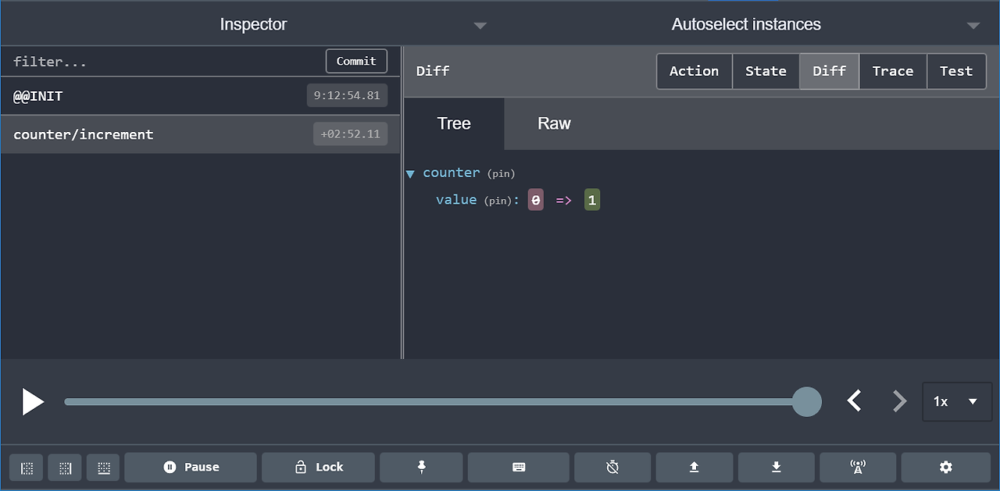
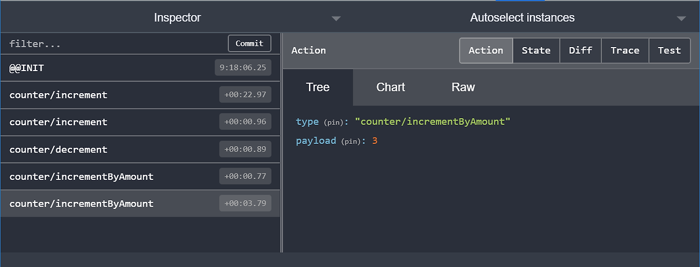

#### 지난 포스트에서 Redux 개요 및 개념에 대해 알아보았다.
#### 이제 이것들이 실제로 어떻게 사용되는지 확인해보자

 

 

### 예시 - Counter 
 

#### 현재 Store는 객체를 값으로 저장한다고 배웠다.

 

#### 초기값은 다음과 같다.

 
```javascript
{
  counter: {
    value: 0
  }
}
```
 

#### 다음의 행동을 수행하여 Redux의 상태관리에 대해 배워보자.
 


### 1. '+' 버튼을 눌렀을 때 행동에 대해 알아보자.
```javascript
        <button
          className={styles.button}
          aria-label="Increment value"
          onClick={() => dispatch(increment())}
        >
          +
        </button>
 ```

 

- "+" 버튼을 클릭했을 때, 해당 유형의 액션이 'counter/increment" 스토어로 전송된다.
- 해당 작업이 전송되면 필드의 값인 state.counter.value가 0에서 1로 변경된다.

 

 

### 2. "-"버튼을  클릭했을 때 행동에 대해 알아보자
```javscript
        <button
          className={styles.button}
          aria-label="Decrement value"
          onClick={() => dispatch(decrement())}
        >
        -
        </button>
```
- "-" 버튼을 클릭했을 때, 해당 유형의 액션이 'counter/decrement" 스토어로 전송된다
- 해당 작업이 전송되면 state.counter.value가 1에서 0으로 변경된다.
### 3. "금액 추가"버튼을 클릭한다.
### 4. "비동기 추가" 버튼을 클릭하여 버튼에 진행률 표시줄이 채워지는 과정
 
#### 위 절차를 실행한 후 결과 값은..
 
 

### 이 작업 객체가 다음과 같은 모습임을 알 수 있다.

 
```javascript
{
  type: 'counter/incrementByAmount',
  payload: 3
}
 ```

 

### Application Contents
#### 이제 각 컴포넌트들을 씹고 뜯고 즐겨보자

 

### 먼저 폴더 구조는 다음과 같다.

 

- /src
    - index.js : 앱의 시작점
    - App.js : 최상위 React 컴포넌트
    - /app
        - store.js : Redux 스토어 인스턴스(객체)를 생성
    - /features
        - /counter
            - Counter.js : 카운터 기능의 UI를 보여주는 React 컴포넌트
            - counterSlice.js : 카운터 기능에 대한 Redux 로직
 

### 먼저 store.js이다.
```javascript
import { configureStore } from '@reduxjs/toolkit'
import counterReducer from '../features/counter/counterSlice'

export default configureStore({ // Redux Toolkit 함수를 사용하여 생성
이것이 호출되면 configureStore 객체의 모든 리듀서를 전달
  reducer: {
    counter: counterReducer
  }
})
 ```

### 예를 들어 블로깅 앱 설정은 다음과 같다.
#### 일반적으로 단일 파일에 함께 정의된다

 
```javascript
import { configureStore } from '@reduxjs/toolkit'
import usersReducer from '../features/users/usersSlice'
import postsReducer from '../features/posts/postsSlice'
import commentsReducer from '../features/comments/commentsSlice'

export default configureStore({
  reducer: {
    users: usersReducer,
    posts: postsReducer,
    comments: commentsReducer
  }
})
 ```


#### 여기서, state.users, state.posts, state.comments들은 각각 Redux 상태의 별도 "슬라이스"이다.

#### 슬라이스를 업데이트하는 함수는 usersReducer이다.

 

#### combineReducer 
    - 각 슬라이스 리듀서를 개별적으로 호출하고, Redux 상태의 특정 슬라이스를 전달하고, 각 반환 값을 최종 새 Redux 상태 객체에 포함시킨다.

```javascript
const rootReducer = combineReducers({
  users: usersReducer,
  posts: postsReducer,
  comments: commentsReducer
})

// root reducer 함수를 인수로 직접 전달
const store = configureStore({
  reducer: rootReducer
})
 ```

### SliceReducer
#### CounterReducer함수로 "슬라이스"들이 온다는 것을 알고 있음에 주의하라.

 
```javascript
import { createSlice } from '@reduxjs/toolkit'

export const counterSlice = createSlice({
  name: 'counter',
  initialState: {
    value: 0
  },
  reducers: {
    increment: state => {
      state.value += 1
    },
    decrement: state => {
      state.value -= 1
    },
    incrementByAmount: (state, action) => {
      state.value += action.payload
    }
  }
})
export const { increment, decrement, incrementByAmount } = counterSlice.actions
export default counterSlice.reducer
 ```

 

#### 이전의 UI에서 다양한 버튼을 클릭하면 세 가지 다른 Redux 작업이 수행되는 것을 보았다.

- { type : "counter/increment" }
- { type: "counter/decrement" }
- { type: "counter/incrementByAmount" }
#### Redux Toolkit에는 action 유형 문자열, action 생성자 함수, action 객체를 생성하고 작업을 처리하는 createSlice 함수가 있다.

 

#### name의 옵션의 문자열은 각 액션 유형의 첫 번째 부분으로 사용되므로

#### "counter" + "increment로 . { type: "counter/increment" }로 액션 유형을 생성

 

#### createSlice : 이렇게 작성한 리듀서 함수와 동일한 이름을 가진 action 생성자를 자동으로 생성해준다.

```javascript
const newState = counterSlice.reducer(
  { value: 10 },
  counterSlice.actions.increment()
)
console.log(newState)
// {value: 11}
 ```

### 이것은 counterSlice의 실제 reducer이다.,

```javascript
incrementByAmount: (state, action) => {
      state.value += action.payload // action.payload가 얼마인지 알아야한다.
    }
 ```

#### state.value에 action.payload의 값을 더하고있는데, 이때 어떠한 값이 더해지는지 우리는 알아야한다.

#### 따라서 reducer에 state와 action의 인수를 갖도록 선언한다(기본 인자값)

 
### 여기까지의 로직은 모두 "동기"적이었다.( 데이터의 요청과 결과가 한 자리에서 동시에 일어나는 것)
- 액션이 전송
- 스토어가 리듀서를 실행하여 새로운 상태를 계산
- 디스 패치 함수가 완료
 

### Thunk를 사용한 비동기 논리 작성
#### thunk란 : 비동기 로직을 포함한 특정 종류의 Reduxㅎ ㅏㅁ수

- getstate를 인수로 dispatch를 하는 내부 thunk 함수
- thunk 함수를 생성하고 반환하는 외부 생성자 함수
 

#### 이것은 CounterSlice의 thunk 액션 생성기의 에이다.

```javascript
export const incrementAsync = amount => dispatch => {
  setTimeout(() => {
    dispatch(incrementByAmount(amount))
  }, 1000)
}
 ```

#### 일반적인 Redux 액션 생성기를 사용하는 것과 같은 방식으로 사용할 수 있다.

```javascript
store.dispatch(incrementAsync(5))
```
 #### 하지만 thunk를 사용하려면 Redux 스토어가 생성될 때 redux-thunk 미들웨어를 Redux 스토어에 추가해야 하지만

#### Redux Toolkit의 configureStore 함수는 이미 자동으로 설정해주므로 thunk를 사용할 수 있다.

 


### 서버로부터 데이터를 가져오기전에 AJAX 호출을 해야할 때 thunk를 사용한 예시

```javascript
// the outside "thunk creator" function
const fetchUserById = userId => {
  // the inside "thunk function"
  return async (dispatch, getState) => {
    try {
      // make an async call in the thunk
      const user = await userAPI.fetchById(userId)
      // dispatch an action when we get the response back
      dispatch(userLoaded(user))
    } catch (err) {
      // If something went wrong, handle it here
    }
  }
}
 ```

 

### useSelector로 데이터 선택하기
 

#### useSelector Hook을 사용하면 Redux 저장소 상태에서 컴포넌트가 필요한 모든 데이터를 추출할 수 있다.

 

```javascript
export const selectCount = state => state.counter.value // 기존의 값 가져오는 방법

// Redux store에 접근할 수 있다면...
const count = selectCount(store.getState()) // 현재 매장 카운터 값 얻어오기
console.log(count)
// 0
 ```

#### 선택자 함수 => 도 인라인 인수도 작성하여 값을 변경 가능

```javascript
const countPlusTwo = useSelector(state => state.counter.value + 2)
 ```

#### action이 전송되고 Redux stroe가 업데이트될 때마다 useSelector선택기 함수를 다시 실행한다.

#### 선택기의 반환값이 지난번과 다른 경우 useSelector의 구성 요소가 새 값으로 다시 렌더링되도록 한다.

 

 

### useDispatch로Dispatching Actions
#### 마찬가지로, Redux 스토어에 접근할 수 있다면 .와 같은 액션 생성자를 사용하여 액션을 전송할 수 있다.

```javascript
store.dispatch(increment())
 ```

#### 하지만 우리는 store 자체에 접근할 수 없기 때문에 dispatch 메소드에 접근할 방법이 필요하다.

 

#### useDispatch Hook이 그 일을 해주는데 다음과 같이 선언한다.

 
```javascript
const dispatch = useDispatch()
 ```

#### 예를 들어 사용자가 버튼을 클릭하는 것과 같은 작업을 수행할 때..

 
```javascript
<button
  className={styles.button}
  aria-label="Increment value"
  onClick={() => dispatch(increment())}
>
  +
</button>
 ```

 

### 구성 요소 및 상태 
 

#### 이제 여러분은 "앱의 모든 상태를 항상 Redux store에 넣어야하나" 생각할 수 있다

 

#### 하지만 그렇지 않다.

#### 앱 전체에 필요한 글로벌 상태만 Redux store에 들어가고,

#### 한 곳에서만 필요한 상태는 컴포넌트 상태에 보관해야 한다.

 
```javascript
const [incrementAmount, setIncrementAmount] = useState('2')

// later
return (
  <div className={styles.row}>
    <input
      className={styles.textbox}
      aria-label="Set increment amount"
      value={incrementAmount} // 실제 사용되는 곳은 1곳 !
      onChange={e => setIncrementAmount(e.target.value)}
    />
    <button
      className={styles.button}
      onClick={() => dispatch(incrementByAmount(Number(incrementAmount) || 0))}
    >
      Add Amount
    </button>
    <button
      className={styles.asyncButton}
      onClick={() => dispatch(incrementAsync(Number(incrementAmount) || 0))}
    >
      Add Async
    </button>
  </div>
)
 
```

#### 입력 핸들러에서 action을 dispatch하고 reducer에 보관함으로써 Redux store에 현재 숫자 문자열을 보관할 수 있다.

#### 하지만 실제로 텍스트 문자열이 사용되는 곳은 `<input>`한 곳이다.

#### 이 경우에는 해당 값을 useState Hook에 보관하는 것이 합리적이다.

 

### ! 주의 !  
#### React + Redux 앱에서 글로벌 상태는 Redux 스토어에 저장되어야 하고, 로컬 상태는 React 구성 요소에 저장되어야 합니다.

 

### useState를 써야할지, Redux를 써야할지 확살히 모르겠다면 다음을 참고하자
- 애플리케이션의 다른 부분도 이 데이터에 관심이 있는가?
- 이 원본 데이터를 토대로 추가파생 데이터를 생성할 수 있어야 하는가?
- 동일한 데이터가 여러 구성 요소를 구성하는데 사용되고 있는가?
- 이 상태를 주어진 시점으로 복원할 수 있는 기능을 사용하고 있는가?
- 데이터를 캐시(다시 요청하는 대신 이미 있는 상태를 사용)하는가?
- UI 구성 요소를 핫 리로딩하는 동안(스왑시 내부 상태를 잃을 수 있음) 이 데이터 일관성을 유지하려 하는가?

### 마지막으로 useSelector와 useDispatch Hook이 어떻게 Redux store와 통신하는가?
 

```javascript
import React from 'react'
import ReactDOM from 'react-dom'
import './index.css'
import App from './App'
import store from './app/store'
import { Provider } from 'react-redux'
import * as serviceWorker from './serviceWorker'

ReactDOM.render( // 항상 React에 루트 컴포넌트를 렌더링하라고 호출하기에
  <Provider store={store}> // Redux 스토어를 백그라운드에서 전달하여 접근할 수 있도록 함
  store에는 스토어가 존재, 그 다음 Provider에 컴포넌트를 넣고 App을 전달
    <App />
  </Provider>,
  document.getElementById('root')
)
```

### useSelector를 통해 데이터를 선택하고, 이를 Redux store와 통신하기 위해 useDispatch<Provider>를 사용하면 된다! 