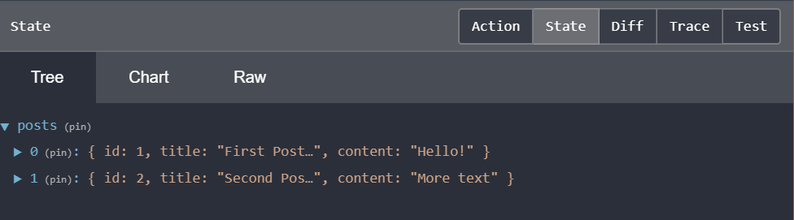
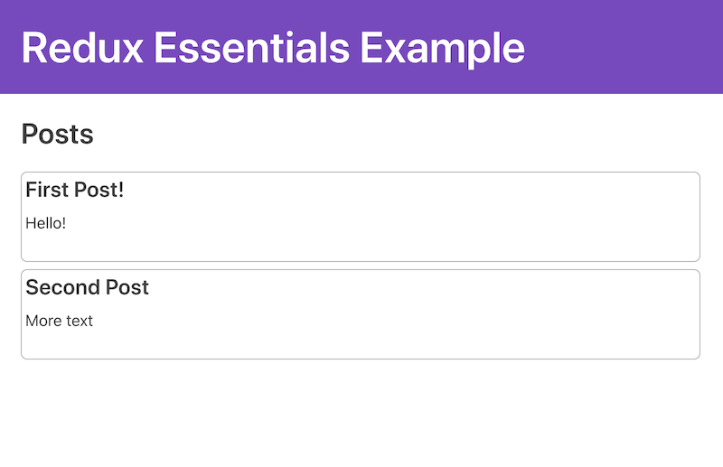

# 학습 목표
- createSlice를 활용하여 Redux store에 reducer logic의 "슬라이스" 추가 방법
- useSelector Hook을 사용하여 컴포넌트에서 Redux 데이터 읽기
- useDispatch Hook을 사용하여 구성 요소에서 작업 전송
### ! 주의 사항 !
actions, reducers, store, dispatching과 같은 핵심 용어에 대해 이해가 필요합니다.

#### 아니라면... 이전 포스트를 읽고 와주세요!
 

### 폴더 및 파일 구조
- /public : HTML 호스트 페이지 템플릿 및 아이콘과 같은 기타 정적 파일
- /src
    - /features
        - posts
            - postsSlice.js 
            - postsList.js
    - index.js : 애플리케이션의 진입점 파일로, React-Redux인 <Provider> 구성요소와 메인 <App> 구성 요소를 렌더링
    - App.js : 주요 애플리케이션의 구성 요소, 다른 콘텐츠에 대한 라우팅 처리
    - index.css : 전체 애플리케이션 스타일
    - /api
        - client.js : GET 및 POST 요청을 할 수 있는 작은 AJAX 요청 클라이언트
        - server.js : 데이터에 대한 가짜 REST API 제공
    - /app
        - Navbar.js : 상단 헤더와 탐색 콘텐츠를 렌더링
        - store.js :  Redux Store 인스턴스(객체) 생성
 

### 1. 게시물
#### 게시물에 대한 데이터를 포함할 새로운 Redux "슬라이스"를 만드는 것이다.

#### Redux store에 해당 데이터가 있으면 React 구성 요소를 만들어 페이지에 해당 데이터를 표시할 수 있다.

 

#### 다음은 postsSlice.js이다.

 

### Redux Toolkit인 createSlice 함수를 사용하여 게시물 데이터를 처리하는 reducer 함수를 만들 것이다.

 

```javascript
import { createSlice } from '@reduxjs/toolkit'

const initialState = [ // 리듀서 함수에는 초기 데이터가 포함 되어야하므로
  { id: '1', title: 'First Post!', content: 'Hello!' },
  { id: '2', title: 'Second Post', content: 'More text' }
]

const postsSlice = createSlice({ // 리듀서 함수 생성
  name: 'posts',
  initialState,
  reducers: {}
})

export default postsSlice.reducer
 ```

### 새로운 슬라이스르 만들 때마다 해당 리듀서 함수를 Redux 스토어에 추가해야 하므로

 

#### store.js( Redux Store 인스턴스(객체) 생성) 에 해당 내용을 추가한다.

```javascript
import { configureStore } from '@reduxjs/toolkit'

import postsReducer from '../features/posts/postsSlice'

export default configureStore({
  reducer: {
    posts: postsReducer
  }
})
 
```

#### 이는 Redux에게 최상위 상태 객체에 inside라는 이름의 필드가 있어야 하며, postsReducer함수를 #### 통해 액션이 전달될 때 함수에 의해 posts의 모든 데이터가 state.posts 업데이트 되어야 함을 나타낸다.

 


### 2. 게시물 목록
#### 이제 스토어에 게시물 데이터가 있으므로 게시물 목록을 보여주는 React 구성 요소를 만들 수 있다.

#### 이러한 기능을 PostsList.js에 작성하도록 하겠다.


#### 우선, 게시물 목록을 렌더링하려면 어디에선가 데이터를 가져와야 한다

#### 이때 사용하는 것이 useSelector Hook으로, 이것을 통해 Redux Store에서 데이터를 읽을 수 있다.

#### 이 선택자 함수는 전체 Redux state 객체를 매개변수로 홏출되며, 구성 요소에 필요한 특정 데이터를 스토어에서 반환한다.

 
```javascript
import React from 'react'
import { useSelector } from 'react-redux'

export const PostsList = () => {
  const posts = useSelector(state => state.posts)

  const renderedPosts = posts.map(post => ( // 처음 게시물.. 다음 게시물 .. 반복
    <article className="post-excerpt" key={post.id}>
      <h3>{post.title}</h3>
      <p className="post-content">{post.content.substring(0, 100)}</p>
    </article>
  ))

  return (
    <section className="posts-list">
      <h2>Posts</h2>
      {renderedPosts}
    </section>
  )
}
 ```

#### 그다음.. 구성 요소를 표시하도록 App.js에서 라우팅 업데이트를 해줘야한다.

#### 구성 요소를 PostsList에서 가져오기 때문에 이것을 Wrapping할 것이다.

 
```javascript
import { PostsList } from './features/posts/PostsList'

function App() {
  return (
    <Router>
      <Navbar />
      <div className="App">
        <Switch>
          <Route
            exact
            path="/"
            render={() => (
              <React.Fragment>
                <PostsList />
              </React.Fragment>
            )}
          />
          <Redirect to="/" />
        </Switch>
      </div>
    </Router>
  )
}
 ```
 

 


